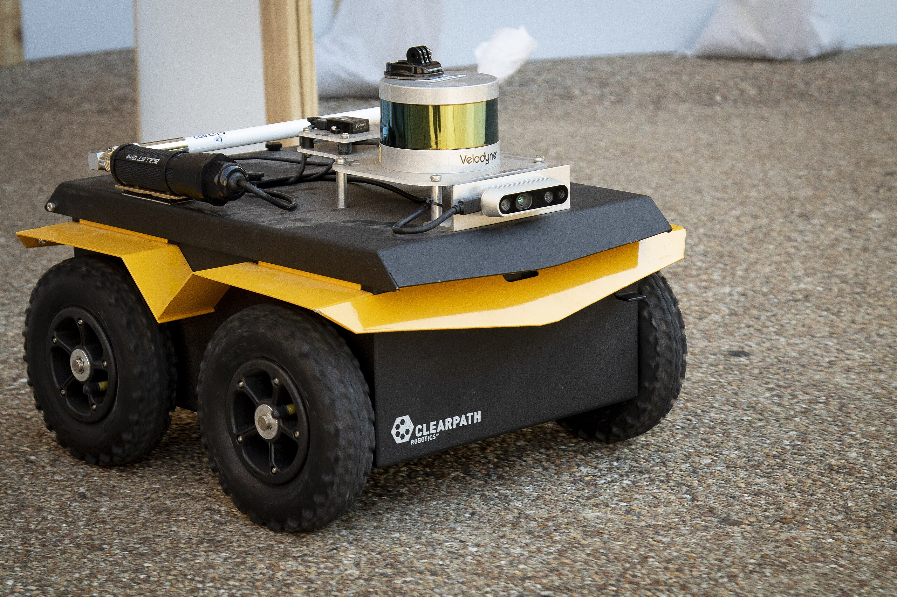

# Jackal Robot Real Time Appearance Based Mapping with ROS 2

## Table of Contents
1. [Introduction](#introduction)
2. [Hardware Requirements](#hardware-requirements)
3. [Software Requirements](#software-requirements)
4. [Repository Structure](#repository-structure)
5. [Installation & Setup](#installation--setup)
6. [Running the Simulation](#running-the-simulation)
7. [Running on the Real Jackal](#running-on-the-real-jackal)
8. [Results](#results)

---

## Introduction
This repository contains the necessary files and scripts to run **SLAM (Simultaneous Localization and Mapping)** on a **Clearpath Jackal robot** using **ROS 2 Humble**. The system integrates **2D and 3D LiDAR, Odometry, and a RealSense Camera** for real-time mapping and localization.

---

## Hardware Requirements
To run this project on a physical Jackal robot, you need the following hardware:

- **Jackal UGV (Clearpath Robotics)**  
  
---

## Software Requirements
Ensure you have the following software installed:

- **Ubuntu 22.04**
- **ROS 2 Humble** ([Installation Guide](https://docs.ros.org/en/humble/Installation.html))
- **Gazebo for simulation**
- **RTAB-Map for SLAM**
   ```bash
   sudo apt install ros-humble-rtabmap*
   ```
- **Ros2 realsense packages**
   ```bash
   sudo apt install ros-humble-realsense*
   ```
- **Python and ultralitics for YOLO to work**
- **Colcon for building packages**
- **Make sure the sensors are connected to the robot and download drivers and ping them**
([Robosense Lidar](https://github.com/RoboSense-LiDAR/rslidar_sdk))
([Rp Lidar](https://github.com/Slamtec/rplidar_ros))
---

## Repository Structure

```
│-- jackal_real/              # Code for running on the real Jackal
│-- jackal_simulation/        # Simulation environment
│-- README.md                 # This file
```
---

## Installation & Setup
1. Clone the repository:
   ```bash
   git clone https://github.com/yourusername/jackal_slam.git
   cd jackal_slam
   ```

2. Install dependencies:
   ```bash
   sudo apt-get update && sudo apt-get install -y ros-humble-navigation2 ros-humble-slam-toolbox ros-humble-rtabmap-ros
   ```

3. Build the workspace:
   ```bash
   colcon build
   ```

4. Source the workspace:
   ```bash
   source install/setup.bash
   ```

---

## Running the Simulation
Go under `jackal_simulation` repository and build the repo and source it:
```bash
colcon build --symlink-install && source install/setup.bash
```
To launch the Jackal in **Gazebo simulation** This will launch a virtual environment with Jackal in a pre-defined world and the **RViz** visualization:
```bash
ros2 launch jackal_gazebo_sim cafe_world.launch.py
```
---

## Running on the Real Jackal
### 1. Boot into ROS 2
Ensure the **Jackal onboard computer** is running **Ubuntu 22.04 with ROS 2 Humble**.

### 2. SSH into the Jackal
```bash
ssh your_robot@ip_address
```
Password: `your_password`

### 3. Launch Jackal sensors
build the repo and source it first:
```bash
colcon build --symlink-install && source install/setup.bash
```
then launch the sensors
```bash
ros2 launch jackal_bringup bringup.launch.py
```

### 4. Launch RTAB-Map SLAM
```bash
ros2 launch jackal_rtab_map rtab_map.launch.py
```

### 5. Visualize Data in RViz
```bash
ros2 launch jackal_rtab_map rviz.launch.py
```
---

## Results
Below are some images of **SLAM mapping results** from both **simulation** and **real-world execution**:


---

## Troubleshooting
- If the Reconstruction doesn’t work, check the frequencies of he camera topic and the 2D lidar topic **in RQT from ROS** using:
  ```bash
  rqt
  ```

---

## Contributors
- **Prince** (@jaja1808)
- **Alain** (@alainlattouf97)

---

## License
MIT License. See `LICENSE` file for details.
